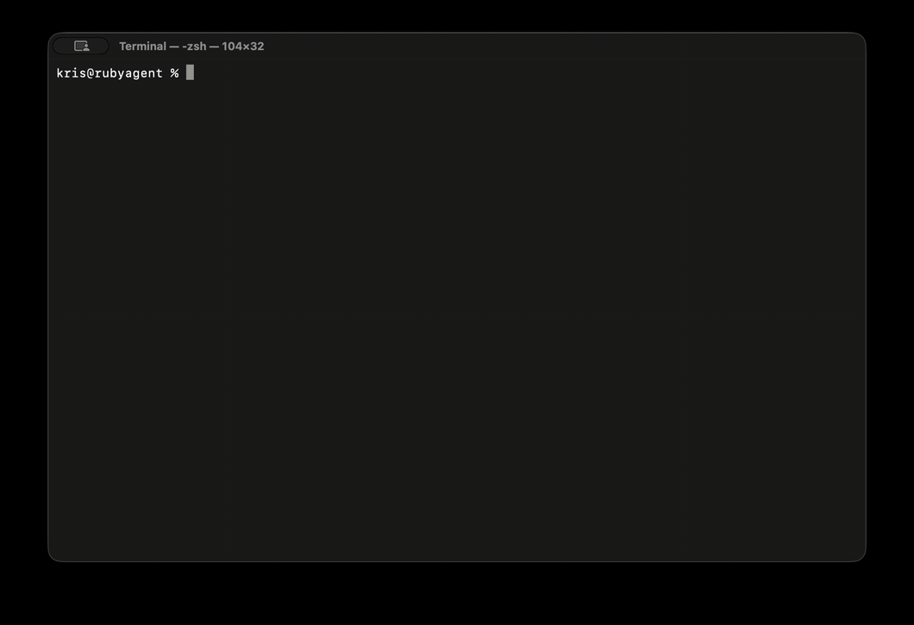

# Gemlings

[](https://rubygems.org/gems/gemlings)
[](https://github.com/khasinski/gemlings/actions/workflows/ci.yml)

A radically simple, code-first AI agent framework for Ruby. Inspired by [smolagents](https://github.com/huggingface/smolagents).

LLMs write and execute Ruby code -- not JSON blobs. This means tool calls are just method calls, variables persist between steps, and the full power of Ruby is available to the agent at every turn.



## Installation

```bash
gem install gemlings
```

Or add to your Gemfile:

```ruby
gem "gemlings"
```

Requires Ruby 3.2+. JRuby 9.4+ is also supported — the sandbox automatically switches from fork-based to thread-based execution, and platform-specific gems (lipgloss) are skipped gracefully.

## Quick start

```ruby
require "gemlings"

agent = Gemlings::CodeAgent.new(model: "anthropic/claude-sonnet-4-20250514")
agent.run("What is the 118th Fibonacci number?")
```

The agent will think, write Ruby code, execute it in a sandbox, and return the answer.

## Model support

Pass a model string as `provider/model_name`:

```ruby
# Anthropic
Gemlings::CodeAgent.new(model: "anthropic/claude-sonnet-4-20250514")

# OpenAI
Gemlings::CodeAgent.new(model: "openai/gpt-4o")

# Ollama (local)
Gemlings::CodeAgent.new(model: "ollama/qwen2.5:3b")
```

Set API keys via environment variables: `ANTHROPIC_API_KEY`, `OPENAI_API_KEY`.

## Agent types

**CodeAgent** -- the LLM writes Ruby code that gets executed in a sandboxed environment. Tools are available as methods. Variables persist between steps. On MRI, code runs in a forked child process for full isolation; on JRuby, a thread-based executor is used automatically since fork is unavailable — no configuration needed.

```ruby
agent = Gemlings::CodeAgent.new(model: "anthropic/claude-sonnet-4-20250514")
```

**ToolCallingAgent** -- the LLM uses structured tool calls (OpenAI function calling style). Better for models with strong tool_call support.

```ruby
agent = Gemlings::ToolCallingAgent.new(model: "openai/gpt-4o")
```

## Custom tools

Define tools as classes:

```ruby
class StockPrice < Gemlings::Tool
  tool_name "stock_price"
  description "Gets the current stock price for a ticker symbol"
  input :ticker, type: :string, description: "Stock ticker symbol (e.g. AAPL)"
  output_type :number

  def call(ticker:)
    # Your implementation here
    182.52
  end
end

agent = Gemlings::CodeAgent.new(
  model: "anthropic/claude-sonnet-4-20250514",
  tools: [StockPrice]
)
```

Or define them inline:

```ruby
weather = Gemlings.tool(:weather, "Gets weather for a city", city: "City name") do |city:|
  "72F and sunny in #{city}"
end

agent = Gemlings::CodeAgent.new(model: "anthropic/claude-sonnet-4-20250514", tools: [weather])
```

## MCP tools

Load tools from any [MCP](https://modelcontextprotocol.io/) server:

```ruby
tools = Gemlings.tools_from_mcp(command: ["npx", "-y", "@modelcontextprotocol/server-filesystem", "/tmp"])

agent = Gemlings::CodeAgent.new(
  model: "anthropic/claude-sonnet-4-20250514",
  tools: tools
)
```

## Structured output

Validate final answers against a JSON Schema or custom proc:

```ruby
schema = {
  "type" => "object",
  "required" => ["name", "age"],
  "properties" => {
    "name" => { "type" => "string" },
    "age" => { "type" => "integer" }
  }
}

agent = Gemlings::CodeAgent.new(
  model: "anthropic/claude-sonnet-4-20250514",
  output_type: schema
)
```

If the output doesn't match, the agent retries automatically.

## Final answer checks

Add validation procs that can reject answers and force retries:

```ruby
agent = Gemlings::CodeAgent.new(
  model: "anthropic/claude-sonnet-4-20250514",
  final_answer_checks: [
    ->(answer, memory) { answer.length > 10 },
    ->(answer, memory) { !answer.include?("I don't know") }
  ]
)
```

## Prompt customization

Inject additional instructions without overriding the full system prompt:

```ruby
agent = Gemlings::CodeAgent.new(
  model: "anthropic/claude-sonnet-4-20250514",
  instructions: "Always respond in French. Use metric units."
)
```

Or fully replace prompts:

```ruby
templates = Gemlings::PromptTemplates.new(
  system_prompt: "You are a data analyst. Tools: {{tool_descriptions}}"
)

agent = Gemlings::CodeAgent.new(
  model: "anthropic/claude-sonnet-4-20250514",
  prompt_templates: templates
)
```

## Step-by-step execution

Run one step at a time for debugging or custom UIs:

```ruby
agent = Gemlings::CodeAgent.new(model: "anthropic/claude-sonnet-4-20250514")

agent.step("What is 2+2?")
agent.step until agent.done?

puts agent.final_answer_value
```

## Multi-agent workflows

Nest agents as tools:

```ruby
researcher = Gemlings::ToolCallingAgent.new(
  model: "openai/gpt-4o",
  name: "researcher",
  description: "Researches topics on the web",
  tools: [Gemlings::WebSearch]
)

manager = Gemlings::CodeAgent.new(
  model: "anthropic/claude-sonnet-4-20250514",
  agents: [researcher]
)

manager.run("Find out when Ruby 3.4 was released and summarize the key features")
```

## Planning

Enable periodic re-planning during long runs:

```ruby
agent = Gemlings::CodeAgent.new(
  model: "anthropic/claude-sonnet-4-20250514",
  planning_interval: 3,  # Re-plan every 3 steps
  max_steps: 15
)
```

## CLI

```bash
# Simple query
gemlings "What is the 10th prime number?"

# With options
gemlings -m anthropic/claude-sonnet-4-20250514 -t web_search "Who won the latest Super Bowl?"

# Tool-calling agent
gemlings -a tool_calling -m openai/gpt-4o "What is 6 * 7?"

# With MCP tools
gemlings --mcp "npx -y @modelcontextprotocol/server-filesystem /tmp" "List files in /tmp"

# Interactive mode
gemlings -i
```

## Configuration

| Option | Default | Description |
|---|---|---|
| `model:` | -- | Model string (`provider/model_name`) |
| `tools:` | `[]` | Array of Tool classes or instances |
| `agents:` | `[]` | Array of Agent instances (become callable tools) |
| `max_steps:` | `10` | Maximum agent steps before stopping |
| `planning_interval:` | `nil` | Re-plan every N steps |
| `instructions:` | `nil` | Extra instructions appended to system prompt |
| `prompt_templates:` | `nil` | `PromptTemplates` to override system/planning prompts |
| `output_type:` | `nil` | Hash (JSON Schema) or Proc for output validation |
| `final_answer_checks:` | `[]` | Array of procs `(answer, memory) -> bool` |
| `step_callbacks:` | `[]` | Array of procs `(step, agent:) -> void` |

## License

MIT
